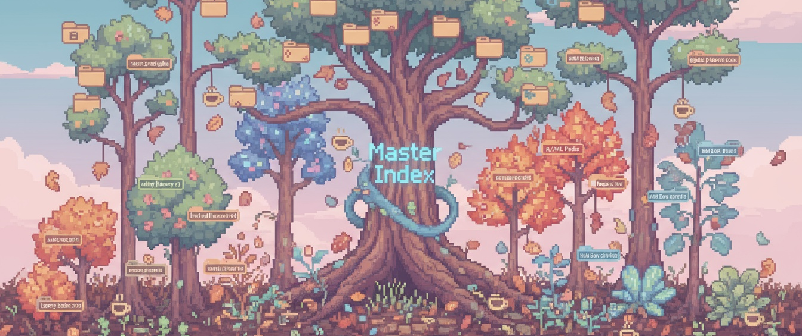
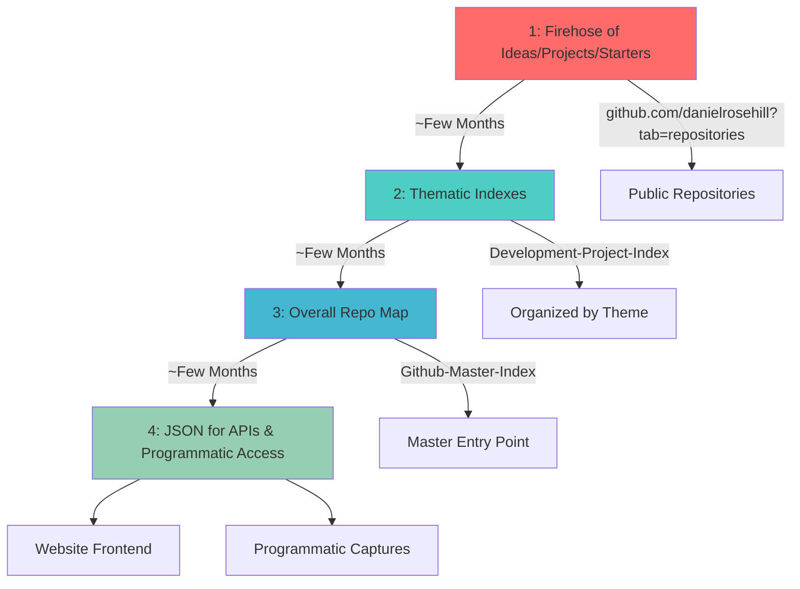

# How I Use Github

This repo documents my somewhat unconventional approach to GitHub. I'm a creative-tech hybrid with ADHD and too much coffee, which means I create a lot of repos - often at 3am when ideas hit.

If that sounds chaotic, you're right. But there's actually a method to it.

## Why This Exists

The advent of AI tools that let me use natural language to build things has been incredible. On good days with time for side projects, I lean into it hard. This means lots of experimental repos, prototype ideas, and documentation scattered across GitHub.

**Fair warning:** If you're following me and getting notification fatigue, feel free to adjust your settings or unfollow - genuinely no offense taken. I create repos because I'm genuinely excited about the work, not to spam anyone's feed or game some algorithm.

Here's how I make sense of the output:

## Daniel's Lagging Order Method

## Repo Publication Flow

### Flow Stages

1. **Firehose of ideas/projects/starters**
   [Browse all public repositories](https://github.com/danielrosehill?tab=repositories&q=&type=public&language=&sort=)

2. **Thematic indexes**
   [Development Project Index](https://github.com/danielrosehill/Development-Project-Index)

3. **Overall repo map**
   [Github Master Index](https://github.com/danielrosehill/Github-Master-Index)

4. **JSON for APIs and programmatic captures**
   Used for website frontend and programmatic access

### The Process

**Create:** I generate lots of repos - notes, project starters, updated templates, experimental ideas. Sometimes in bursts, sometimes steadily over time.

**Coalesce:** Over time, patterns emerge. Ideas and interests naturally cluster together, and I start seeing connections and commonalities. This is where the fun begins (turns out I enjoy taxonomy).

**Organize:** I gather related repos into topic-based indexes, like [this one for Gemini vibe-coding projects](https://github.com/danielrosehill/Gemini-Vibe-Coding-Projects). I also maintain a [master index](https://github.com/danielrosehill/Github-Master-Index) as an entry point to the whole ecosystem.

I've tried multiple times to automate the indexing with AI - it never quite works as elegantly as I'd hoped. Mostly it's manual curation, which honestly isn't the worst thing.

**Prune:** About once a year, I archive or delete repos that are no longer relevant or serving a purpose. Keeps things from becoming complete chaos. 

## Collaboration

I've collaborated on projects and contributed docs and code, and I'm always open to doing more. Most of my GitHub activity focuses on prototyping ideas and fleshing out concepts. Documentation is a particular strength - if you need clear, accessible docs for a technical project, that's my sweet spot.

## Contact

I get more email than you'd expect for someone still relatively obscure. I try to respond to everything, but it might take me a bit. Thanks for your patience.

